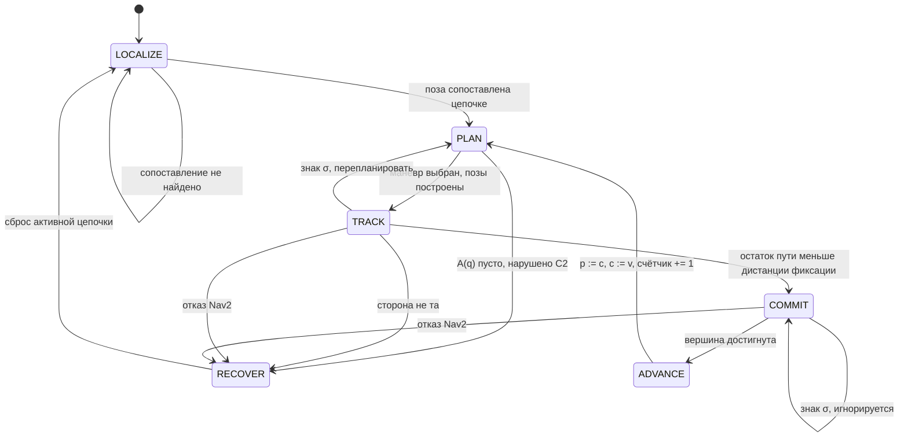

# Движение по полосам: полуавтомат маршрута и автомат исполнителя

Граф задаёт разметочную линию. Сторона движения — следствие порядка пары вершин, а не хранимое состояние.

---

## 1. Объекты и обозначения

Граф `G = (V, E)`. Вершины `V ⊂ ℝ²` заданы координатами в метрической системе карты. Каждое ребро `e ∈ E` ориентировано и несёт полилинию `π(e) = (P₀ … Pₙ)` от начальной вершины к конечной. Геометрически `π` — **разметочная линия**, а не центр полосы.

`V_L ⊆ V` — логические вершины, помеченные в данных графа.

Система координат правая: `x` на восток, `y` на север, `ẑ = x̂ × ŷ` вверх. В системе с `y` вниз знаки нормалей и классов поворота меняются на противоположные.

```
косое произведение      a × b = aₓb_y − a_y bₓ        (скаляр)
скалярное произведение  a · b = aₓbₓ + a_y b_y
```

---

## 2. Цепочки

Для `u, v ∈ V_L` **цепочка** — путь в `G`:

```
γ = (u = w₀, w₁, …, w_k = v),   wᵢ ∈ V,  k ≥ 1
при условии  wᵢ ∉ V_L  для всех  0 < i < k
```

Внутри цепочки нет других логических вершин. `u` и `v` **смежны**, если между ними есть хотя бы одна цепочка.

**Вывод:** обход от `u` по каждому инцидентному ребру независимо от того, в какую сторону ребро записано; продолжение пока текущая вершина `∉ V_L`; на вершинах ветвления обход разделяется.

**Полилиния цепочки:** конкатенация полилиний рёбер, каждая ориентирована от `wᵢ` к `wᵢ₊₁`. Если ребро записано как `wᵢ₊₁ → wᵢ`, порядок его точек обращается. Результат: `Π(γ) = (Q₀ … Q_m)`, где `Q₀` в `u`, `Q_m` в `v`.

Обращение — бухгалтерия, не логика: граф хранит каждый сегмент разметки один раз, и обе стороны движения пользуются одной записью.

---

## 3. Сторона движения

Цепочка ориентирована согласно упорядоченной паре шага маршрута. Для сегмента `i ∈ [0, m−1]`:

```
касательная    tᵢ = (Qᵢ₊₁ − Qᵢ) / ‖Qᵢ₊₁ − Qᵢ‖

правая нормаль nᵢ = tᵢ × ẑ = ( tᵢ,y , −tᵢ,ₓ )

точка полосы   p = c + κ·d·nᵢ,   c = Qᵢ + s(Qᵢ₊₁ − Qᵢ),  s ∈ [0,1]
```

`d > 0` — смещение центра полосы от линии. `κ = +1` правостороннее движение, `κ = −1` левостороннее. Это единственное место, где сторона задана параметром.

### Знаковое смещение произвольной точки

```
σᵢ(q) = tᵢ × (q − Qᵢ) = tᵢ,ₓ(q_y − Qᵢ,y) − tᵢ,y(qₓ − Qᵢ,ₓ)

σ > 0  слева от направления движения
σ < 0  справа
σ = 0  на линии
```

Центр правой полосы при `σ = −d`. При `‖t‖ = 1` величина `|σ|` равна расстоянию до прямой сегмента, поэтому `σ` — одновременно признак стороны и метрика отклонения.

### Обращение пары

Обратный порядок даёт `t → −t`, следовательно `n = t × ẑ → −n`. Правая сторона переходит в физически противоположную сторону той же линии. Две встречные полосы — это одна линия и два порядка пары: **переключать нечего, потому что нет переменной.**

---

## 4. Излом и вынос точки

Во внутренней вершине `Qᵢ` (`0 < i < m`) стыкуются сегменты с касательными `tᵢ₋₁` и `tᵢ`.

```
угол излома   δᵢ = atan2( tᵢ₋₁ × tᵢ , tᵢ₋₁ · tᵢ )

биссектриса   b = (nᵢ₋₁ + nᵢ) / ‖nᵢ₋₁ + nᵢ‖

вынос         L = d / cos(δᵢ/2)

точка         p = Qᵢ + κ·L·b
```

**Откуда множитель.** Точка обязана отстоять на `d` от **обеих** прямых, а не от их биссектрисы: `L·(b · nᵢ₋₁) = d`. Нормали получены поворотом своих касательных на один и тот же угол, поэтому угол между `nᵢ₋₁` и `nᵢ` равен `δᵢ`, а биссектриса делит его пополам: `b · nᵢ₋₁ = cos(δᵢ/2)`. Отсюда `L = d / cos(δᵢ/2)`.

**Вырождение.** При `|δᵢ| → π` знаменатель → 0 и `L → ∞`: на остром изломе точка уезжает наружу неограниченно. Именно здесь возникают числа, которые приходится подпирать руками.

Ограничение: `L ≤ d·μ`, `μ > 1`. При превышении одна точка на биссектрисе заменяется двумя — конец сегмента `i−1`, смещённый на `d·nᵢ₋₁`, и начало сегмента `i`, смещённое на `d·nᵢ`. Излом скругляется вместо выноса.

---

## 5. Классификация маневра

Робот прибыл в логическую вершину `c` из `p`; `v` — кандидат на следующую вершину. Две касательные берутся **у самой вершины `c`**:

- `τ⁻` — касательная последнего сегмента цепочки `p → c`
- `τ⁺` — касательная первого сегмента цепочки `c → v`

```
Δ(p, c, v) = atan2( τ⁻ × τ⁺ , τ⁻ · τ⁺ ),   Δ ∈ (−π, π]
```

Косого произведения одного недостаточно: `τ⁻ × τ⁺ ≈ 0` и при движении прямо, и при развороте. Различает их скалярное произведение — поэтому нужен `atan2` от обоих.

| условие | класс | смысл |
|---|---|---|
| `\|Δ\| ≤ ε` | `straight` | направление сохраняется |
| `\|Δ\| ≥ π − ε` | `uturn` | возврат по той же цепочке |
| `Δ > 0` | `left` | против часовой |
| `Δ < 0` | `right` | по часовой |

**Порога недостаточно.** На косом перекрёстке два выхода могут оказаться под −20° и +20°: абсолютный порог назовёт оба `straight`. Поэтому кандидаты, попавшие в один класс, разделяются **по порядку `Δ`**: наименьший получает `right`, наибольший `left`, ближайший к нулю остаётся `straight`. Прямоугольный перекрёсток описывается привычно, косой не ломается.

### Почему состояние — пара вершин

Метки привязаны не к вершине, а к паре «откуда, где». Четырёхлучевой перекрёсток, одни и те же лучи:

| прибыл | север | восток | юг | запад |
|---|---|---|---|---|
| с юга | `straight` | `right` | `uturn` | `left` |
| с востока | `right` | `uturn` | `left` | `straight` |

Вершина без предыстории не определяет набор доступных классов — отсюда `Q ⊆ V_L × V_L`.

---

## 6. Полуавтомат маршрута

`M = (Q, Σ, δ)` — без начального состояния и без принимающих: это набор правил перехода, а не распознаватель языка.

```
Q = { (p, c) ∈ V_L × V_L : p смежна c }      прибыл в c из p

Σ = { left, straight, right, uturn }

δ : Q × Σ ⇀ Q,   δ((p,c), s) = (c, v),  где класс(p,c,v) = s
```

`δ` частичная: не всякий класс существует в каждом состоянии. Вся таблица вычисляется один раз при загрузке из `G` и `V_L`, в реальном времени только читается. Её можно распечатать и проверить глазами до выезда.

---

## 7. Условия корректности

Проверяемо на предвычисленных `δ` и множестве цепочек, до выезда. Нарушение — дефект графа, а не рантайма.

**C1 · детерминированность.** `∀q ∈ Q, ∀s ∈ Σ`: не более одного `v`. Нарушается, когда два кандидата попали в один класс. Ремонт — разделение по порядку `Δ` внутри класса (§5). Если совпадение осталось, `M` в этом состоянии недетерминирован и граф надо править.

**C2 · отсутствие тупиков.** `∀q`: существует хотя бы один `s` с определённым `δ(q,s)`. Геометрически `uturn` есть всегда — возврат по той же цепочке, — поэтому условие держится, пока разворот не запрещён политикой.

**C3 · живость вперёд.** `∀q`: существует `s ≠ uturn` с определённым `δ(q,s)`. Именно это делает запрет немедленного разворота безопасным. Состояния, где условие не выполнено — настоящие тупиковые отростки, — образуют список исключений, где разворот обязан быть разрешён. Список **выводится**, а не пишется руками.

**C4 · достижимость.** Ориентированный граф `(Q, δ)` сильно связен, либо каждое состояние достижимо из начального. Иначе исследование маршрута способно запереть себя в подобласти: счётчики посещений растут, часть карты недосягаема. Проверяется поиском компонент сильной связности.

**C5 · единственность цепочки.** Для каждой смежной пары `(u, v)` цепочка единственна. Если внутренняя структура даёт несколько путей для одного маневра, геометрия неоднозначна и автоматика выберет непредсказуемо. Ремонт — убрать избыточные внутренние рёбра из `G`. Выбор по кратчайшей длине допустим, но обязан попасть в отчёт: для левого поворота кратчайший путь срезает угол.

---

## 8. Функция выбора

Полуавтомат задаёт, *что возможно*. Что выбрано — функция от состояния, распознанного знака `s* ∈ Σ ∪ {⊥}` и счётчиков посещений `ν : V_L → ℕ`.

```
A(q)  = { s ∈ Σ : δ(q,s) определено }
A′(q) = A(q) \ { uturn }       если непусто, иначе A(q)

                 ⎧ s*                                    если s* ∈ A′(q)
choose(q,s*,ν) = ⎨
                 ⎩ argmin ( ν(target(q,s)) , ord(s) )     иначе
                   s ∈ A′(q)
```

Детерминирована при заданных `(q, s*, ν)`: `ord` — фиксированный полный порядок на `Σ`, поэтому равенство счётчиков разрешается воспроизводимо и один прогон даёт один маршрут. Это делает поведение тестируемым без робота.

Знак, для которого нет доступного класса (`s* ∉ A′`), падает на счётчик посещений. Альтернатива — остановка — требует отдельного решения; молчаливый выбор произвольного маневра недопустим.

---

## 9. Автомат исполнителя

`A = (S, Γ, τ, s₀)`, `s₀ = LOCALIZE`. В отличие от `M`, начальное состояние есть, и переходы срабатывают на событиях, а не на командах маневра.



**Барьер фиксации** — единственная причина существования `COMMIT`: знак перепланирует маневр в `TRACK`, но в `COMMIT` не меняет ничего. Без барьера знак, распознанный на последних сантиметрах, менял бы геометрию посреди начатого маневра.

| из | событие | в | действие |
|---|---|---|---|
| `LOCALIZE` | поза сопоставлена цепочке | `PLAN` | установить `(p, c)` |
| `LOCALIZE` | сопоставление не найдено | `LOCALIZE` | повтор |
| `PLAN` | маневр выбран, позы построены | `TRACK` | опубликовать позы |
| `PLAN` | `A(q) = ∅` | `RECOVER` | нарушено C2 |
| `TRACK` | знак `σ` | `PLAN` | пересчитать маневр и позы |
| `TRACK` | `ℓ ≤ ℓc` | `COMMIT` | зафиксировать решение |
| `TRACK` | `sign(σ_факт) ≠ sign(−d)` | `RECOVER` | флаг нарушения |
| `TRACK` | отказ Nav2 | `RECOVER` | — |
| `COMMIT` | знак `σ` | `COMMIT` | **ничего** |
| `COMMIT` | вершина достигнута | `ADVANCE` | — |
| `COMMIT` | отказ Nav2 | `RECOVER` | — |
| `ADVANCE` | всегда | `PLAN` | `p:=c`, `c:=v`, `ν(c)+=1` |
| `RECOVER` | восстановлен | `LOCALIZE` | сбросить активную цепочку |

### Ориентация целевой позы

Финальная поза у `c` получает `yaw` не по направлению прибытия, а по первому сегменту **следующей** цепочки. Робот доезжает уже развёрнутым, поворот не выполняется отдельным маневром на месте.

Следствие: `δ` применяется с упреждением на один шаг — чтобы поставить `yaw`, следующий маневр должен быть выбран заранее. Поэтому в `TRACK` знак перепланирует не только хвост маршрута, но и ориентацию прибытия в текущую цель.

### Нижняя граница дистанции фиксации

`ℓc` обязана превышать путь, проходимый за время перепланирования, иначе поздний знак попадёт в `COMMIT` уже после расхождения геометрии:

```
ℓc ≥ v_max · t_replan + запас
```

---

## 10. Локализация и монитор нарушения

### Начальное сопоставление

Дана поза `(q, θ)`. Для каждой цепочки и каждого из двух порядков обхода считается `σ` относительно ближайшего сегмента. Порядок, согласованный с правосторонним движением, — тот, при котором `σ < 0`. Курс служит подтверждением, а не основным признаком:

```
score = w₁·| σ − (−d) | + w₂·( 1 − cos(θ − ∠t) )   → min
```

Смена активной цепочки — только при улучшении `score` на порог `m`, удержанном `N` тиков. Без гистерезиса у перекрёстка, где рядом несколько цепочек, выбор будет дёргаться.

### Монитор

В движении `σ` сравнивается с ожидаемым `−d`. Расхождение знака означает, что робот на встречной полосе, и поднимает флаг — **но не меняет цель**.

Замыкание этой петли даёт положительную обратную связь: дрейф через линию → «ты уже в другой полосе» → переворот целевого смещения → осознанный выезд на встречку. Сторона берётся из порядка пары (§3), измерение служит только диагностикой.

---

## 11. Параметры

Всё настраиваемое — свойства робота и политики, не трассы.

| параметр | смысл | появляется в |
|---|---|---|
| `d` | смещение центра полосы от разметочной линии | §3, §4 |
| `κ` | `+1` правостороннее, `−1` левостороннее движение | §3, §4 |
| `ε` | порог классов `straight` и `uturn` | §5 |
| `μ` | предел выноса точки в изломе, `L ≤ d·μ` | §4 |
| шаг поз | густота точек вдоль цепочки | §3 |
| `ℓc` | дистанция фиксации решения | §9 |
| `w₁, w₂` | веса смещения и курса при локализации | §10 |
| `m, N` | порог и выдержка гистерезиса смены цепочки | §10 |
| `ord` | порядок разрешения равных счётчиков посещений | §8 |

---

## 12. Что объявлено, что выведено

| сущность | откуда берётся |
|---|---|
| вершины, рёбра, полилинии | данные графа |
| логические вершины `V_L` | **объявлены** в данных графа |
| смежность логических вершин | выведена обходом (§2) |
| цепочки и их полилинии | выведены обходом (§2) |
| сторона движения | выведена из порядка пары (§3) |
| точки для Nav2 | выведены (§3, §4), затем **правятся вручную** |
| метки `left` / `straight` / `right` | выведены из угла (§5) |
| таблица переходов `δ` | предвычислена (§6) |
| исключения для разворота | выведены из C3 (§7) |
| поведение на перекрёстке | **отсутствует как отдельная ветка** |

### Точки для Nav2 как редактируемый артефакт

Позы генерируются в отдельный файл и правятся руками. Отсюда два требования к генератору:

- запись, помеченная как правленная вручную, при повторной генерации **сохраняется**, а в отчёт попадает число и перечень пропущенных записей;
- в файле хранится отпечаток графа, из которого он сгенерирован, — иначе не видно, что ручные правки относятся к устаревшей геометрии.

### Чего в схеме нет

Локальный планировщик не различает перекрёсток и прямой участок: везде цепочка рёбер, смещение по нормали и биссектриса в изломах. Глобальный тоже не различает — в вершине перекрёстка просто больше одного кандидата, и включается §5. Отдельной логики «поведение на перекрёстке» не существует, внутренние вершины перекрёстка работают ровно тем же, чем вершины на прямом участке.

---

## Открытые вопросы

1. Политика при `s* ∉ A′(q)` — игнорировать знак или остановиться (§8).
2. Обязана ли проверка C4 быть блокирующей при загрузке, или достаточно предупреждения (§7).
