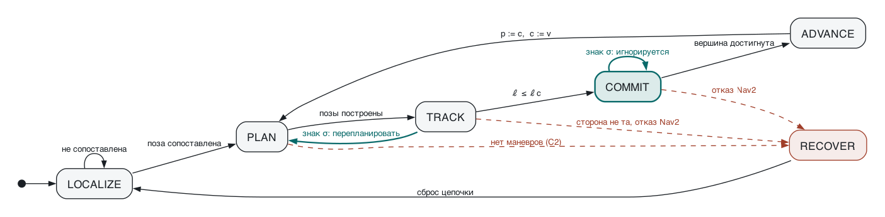

# Движение по полосам: полуавтомат маршрута и автомат исполнителя

Граф задаёт разметочную линию. Сторона движения — следствие порядка пары вершин, а не хранимое состояние.

---

## 1. Объекты и обозначения

Граф $G = (V, E)$. Вершины $V \subset \mathbb{R}^2$ заданы координатами в метрической системе карты. Каждое ребро $e \in E$ ориентировано и несёт полилинию $\pi(e) = (P_0 \dots P_n)$ от начальной вершины к конечной. Геометрически $\pi$ — **разметочная линия**, а не центр полосы.

$V_L \subseteq V$ — логические вершины, помеченные в данных графа.

Система координат правая: $x$ на восток, $y$ на север, $\hat z = \hat x \times \hat y$ вверх. В системе с $y$ вниз знаки нормалей и классов поворота меняются на противоположные.

$$
a \times b = a_x b_y - a_y b_x \quad \text{(скаляр)}
\qquad
a \cdot b = a_x b_x + a_y b_y
$$

---

## 2. Цепочки

Для $u, v \in V_L$ **цепочка** — путь в $G$:

$$
\gamma = (u = w_0,\; w_1,\; \dots,\; w_k = v),
\qquad w_i \in V, \quad k \ge 1
$$

$$
\text{при условии}\quad w_i \notin V_L \quad \text{для всех } 0 < i < k
$$

Внутри цепочки нет других логических вершин. Вершины $u$ и $v$ **смежны**, если между ними есть хотя бы одна цепочка.

**Вывод.** Обход от $u$ по каждому инцидентному ребру независимо от того, в какую сторону ребро записано; продолжение пока текущая вершина $\notin V_L$; на вершинах ветвления обход разделяется.

**Полилиния цепочки.** Конкатенация полилиний рёбер, каждая ориентирована от $w_i$ к $w_{i+1}$. Если ребро записано как $w_{i+1} \to w_i$, порядок его точек обращается. Результат: $\Pi(\gamma) = (Q_0 \dots Q_m)$, где $Q_0$ лежит в $u$, а $Q_m$ в $v$.

Обращение — бухгалтерия, не логика: граф хранит каждый сегмент разметки один раз, и обе стороны движения пользуются одной записью.

---

## 3. Сторона движения

Цепочка ориентирована согласно упорядоченной паре шага маршрута. Для сегмента $i \in [0,\, m-1]$:

$$
t_i = \frac{Q_{i+1} - Q_i}{\lVert Q_{i+1} - Q_i \rVert}
$$

$$
n_i = t_i \times \hat z = \bigl(\, t_{i,y},\; -t_{i,x} \,\bigr)
$$

$$
p = c + \kappa\, d\, n_i,
\qquad c = Q_i + s\,(Q_{i+1} - Q_i),
\quad s \in [0, 1]
$$

Здесь $d > 0$ — смещение центра полосы от линии, $\kappa = +1$ для правостороннего движения и $\kappa = -1$ для левостороннего. Это единственное место, где сторона задана параметром.

### Знаковое смещение произвольной точки

$$
\sigma_i(q) = t_i \times (q - Q_i)
= t_{i,x}\,(q_y - Q_{i,y}) - t_{i,y}\,(q_x - Q_{i,x})
$$

$$
\sigma > 0 \;\Rightarrow\; \text{слева от направления движения}
$$
$$
\sigma < 0 \;\Rightarrow\; \text{справа}
\qquad
\sigma = 0 \;\Rightarrow\; \text{на линии}
$$

Центр правой полосы при $\sigma = -d$. При $\lVert t \rVert = 1$ величина $\lvert \sigma \rvert$ равна расстоянию до прямой сегмента, поэтому $\sigma$ — одновременно признак стороны и метрика отклонения.

### Обращение пары

Обратный порядок даёт $t \to -t$, следовательно $n = t \times \hat z \to -n$. Правая сторона переходит в физически противоположную сторону той же линии. Две встречные полосы — это одна линия и два порядка пары: **переключать нечего, потому что нет переменной.**

---

## 4. Излом и вынос точки

Во внутренней вершине $Q_i$ ($0 < i < m$) стыкуются сегменты с касательными $t_{i-1}$ и $t_i$.

$$
\delta_i = \operatorname{atan2}\bigl(\, t_{i-1} \times t_i,\; t_{i-1} \cdot t_i \,\bigr)
$$

$$
b = \frac{n_{i-1} + n_i}{\lVert n_{i-1} + n_i \rVert}
\qquad
L = \frac{d}{\cos(\delta_i / 2)}
\qquad
p = Q_i + \kappa\, L\, b
$$

**Откуда множитель.** Точка обязана отстоять на $d$ от **обеих** прямых, а не от их биссектрисы:

$$
L \,(b \cdot n_{i-1}) = d
$$

Нормали получены поворотом своих касательных на один и тот же угол, поэтому угол между $n_{i-1}$ и $n_i$ равен $\delta_i$, а биссектриса делит его пополам:

$$
b \cdot n_{i-1} = \cos(\delta_i / 2)
\quad\Longrightarrow\quad
L = \frac{d}{\cos(\delta_i / 2)}
$$

**Вырождение.** При $\lvert \delta_i \rvert \to \pi$ знаменатель стремится к нулю и $L \to \infty$: на остром изломе точка уезжает наружу неограниченно. Именно здесь возникают числа, которые приходится подпирать руками.

Ограничение: $L \le d\,\mu$ при $\mu > 1$. При превышении одна точка на биссектрисе заменяется двумя — конец сегмента $i-1$, смещённый на $d\,n_{i-1}$, и начало сегмента $i$, смещённое на $d\,n_i$. Излом скругляется вместо выноса.

---

## 5. Классификация маневра

Робот прибыл в логическую вершину $c$ из $p$; $v$ — кандидат на следующую вершину. Две касательные берутся **у самой вершины $c$**:

- $\tau^-$ — касательная последнего сегмента цепочки $p \to c$
- $\tau^+$ — касательная первого сегмента цепочки $c \to v$

$$
\Delta(p, c, v) = \operatorname{atan2}\bigl(\, \tau^- \times \tau^+,\; \tau^- \cdot \tau^+ \,\bigr),
\qquad \Delta \in (-\pi,\, \pi]
$$

Косого произведения одного недостаточно: $\tau^- \times \tau^+ \approx 0$ и при движении прямо, и при развороте. Различает их скалярное произведение — поэтому нужен $\operatorname{atan2}$ от обоих.

| условие | класс | смысл |
|---|---|---|
| $\lvert \Delta \rvert \le \varepsilon$ | `straight` | направление сохраняется |
| $\lvert \Delta \rvert \ge \pi - \varepsilon$ | `uturn` | возврат по той же цепочке |
| $\Delta > 0$ | `left` | против часовой |
| $\Delta < 0$ | `right` | по часовой |

**Порога недостаточно.** На косом перекрёстке два выхода могут оказаться под $-20^\circ$ и $+20^\circ$: абсолютный порог назовёт оба `straight`. Поэтому кандидаты, попавшие в один класс, разделяются **по порядку $\Delta$**: наименьший получает `right`, наибольший `left`, ближайший к нулю остаётся `straight`. Прямоугольный перекрёсток описывается привычно, косой не ломается.

### Почему состояние — пара вершин

Метки привязаны не к вершине, а к паре «откуда, где». Четырёхлучевой перекрёсток, одни и те же лучи:

| прибыл | север | восток | юг | запад |
|---|---|---|---|---|
| с юга | `straight` | `right` | `uturn` | `left` |
| с востока | `right` | `uturn` | `left` | `straight` |

Вершина без предыстории не определяет набор доступных классов — отсюда $Q \subseteq V_L \times V_L$.

---

## 6. Полуавтомат маршрута

$M = (Q, \Sigma, \delta)$ — без начального состояния и без принимающих: это набор правил перехода, а не распознаватель языка.

$$
Q = \bigl\{\, (p, c) \in V_L \times V_L \;:\; p \text{ смежна } c \,\bigr\}
\qquad \text{прибыл в } c \text{ из } p
$$

$$
\Sigma = \{\, \texttt{left},\; \texttt{straight},\; \texttt{right},\; \texttt{uturn} \,\}
$$

$$
\delta : Q \times \Sigma \rightharpoonup Q,
\qquad
\delta\bigl((p, c),\, s\bigr) = (c, v)
\quad\text{где}\quad \operatorname{class}(p, c, v) = s
$$

Функция $\delta$ частичная: не всякий класс существует в каждом состоянии. Вся таблица вычисляется один раз при загрузке из $G$ и $V_L$, в реальном времени только читается. Её можно распечатать и проверить глазами до выезда.

---

## 7. Условия корректности

Проверяемо на предвычисленных $\delta$ и множестве цепочек, до выезда. Нарушение — дефект графа, а не рантайма.

**C1 · детерминированность.** $\forall q \in Q,\; \forall s \in \Sigma$: не более одного $v$. Нарушается, когда два кандидата попали в один класс. Ремонт — разделение по порядку $\Delta$ внутри класса (§5). Если совпадение осталось, $M$ в этом состоянии недетерминирован и граф надо править.

**C2 · отсутствие тупиков.** $\forall q$: существует хотя бы один $s$ с определённым $\delta(q, s)$. Геометрически `uturn` есть всегда — возврат по той же цепочке, — поэтому условие держится, пока разворот не запрещён политикой.

**C3 · живость вперёд.** $\forall q$: существует $s \ne \texttt{uturn}$ с определённым $\delta(q, s)$. Именно это делает запрет немедленного разворота безопасным. Состояния, где условие не выполнено — настоящие тупиковые отростки, — образуют список исключений, где разворот обязан быть разрешён. Список **выводится**, а не пишется руками.

**C4 · достижимость.** Ориентированный граф $(Q, \delta)$ сильно связен, либо каждое состояние достижимо из начального. Иначе исследование маршрута способно запереть себя в подобласти: счётчики посещений растут, часть карты недосягаема. Проверяется поиском компонент сильной связности.

**C5 · единственность цепочки.** Для каждой смежной пары $(u, v)$ цепочка единственна. Если внутренняя структура даёт несколько путей для одного маневра, геометрия неоднозначна и автоматика выберет непредсказуемо. Ремонт — убрать избыточные внутренние рёбра из $G$. Выбор по кратчайшей длине допустим, но обязан попасть в отчёт: для левого поворота кратчайший путь срезает угол.

---

## 8. Функция выбора

Полуавтомат задаёт, *что возможно*. Что выбрано — функция от состояния, распознанного знака $s^* \in \Sigma \cup \{\bot\}$ и счётчиков посещений $\nu : V_L \to \mathbb{N}$.

$$
A(q) = \bigl\{\, s \in \Sigma \;:\; \delta(q, s) \text{ определено} \,\bigr\}
$$

$$
A'(q) =
\begin{cases}
A(q) \setminus \{\texttt{uturn}\} & \text{если непусто} \\
A(q) & \text{иначе}
\end{cases}
$$

$$
\operatorname{choose}(q, s^*, \nu) =
\begin{cases}
s^* & \text{если } s^* \in A'(q) \\[4pt]
\displaystyle\operatorname*{arg\,min}_{s \in A'(q)}
\bigl(\, \nu(\operatorname{target}(q, s)),\; \operatorname{ord}(s) \,\bigr)
& \text{иначе}
\end{cases}
$$

Детерминирована при заданных $(q, s^*, \nu)$: $\operatorname{ord}$ — фиксированный полный порядок на $\Sigma$, поэтому равенство счётчиков разрешается воспроизводимо и один прогон даёт один маршрут. Это делает поведение тестируемым без робота.

Знак, для которого нет доступного класса ($s^* \notin A'$), падает на счётчик посещений. Альтернатива — остановка — требует отдельного решения; молчаливый выбор произвольного маневра недопустим.

---

## 9. Автомат исполнителя

$A = (S, \Gamma, \tau, s_0)$, начальное состояние $s_0 = \texttt{LOCALIZE}$. В отличие от $M$, здесь начальное состояние есть, и переходы срабатывают на событиях, а не на командах маневра.

Схема генерируется из списка переходов: `python3 docs/lane_algorithm_automaton.py`.

**Барьер фиксации** — единственная причина существования `COMMIT`: знак перепланирует маневр в `TRACK`, но в `COMMIT` не меняет ничего. Без барьера знак, распознанный на последних сантиметрах, менял бы геометрию посреди начатого маневра.

| из | событие | в | действие |
|---|---|---|---|
| `LOCALIZE` | поза сопоставлена цепочке | `PLAN` | установить $(p, c)$ |
| `LOCALIZE` | сопоставление не найдено | `LOCALIZE` | повтор |
| `PLAN` | маневр выбран, позы построены | `TRACK` | опубликовать позы |
| `PLAN` | $A(q) = \varnothing$ | `RECOVER` | нарушено C2 |
| `TRACK` | знак $\sigma$ | `PLAN` | пересчитать маневр и позы |
| `TRACK` | $\ell \le \ell_c$ | `COMMIT` | зафиксировать решение |
| `TRACK` | $\operatorname{sign}(\sigma_\text{факт}) \ne \operatorname{sign}(-d)$ | `RECOVER` | флаг нарушения |
| `TRACK` | отказ Nav2 | `RECOVER` | — |
| `COMMIT` | знак $\sigma$ | `COMMIT` | **ничего** |
| `COMMIT` | вершина достигнута | `ADVANCE` | — |
| `COMMIT` | отказ Nav2 | `RECOVER` | — |
| `ADVANCE` | всегда | `PLAN` | $p := c$, $c := v$, $\nu(c) \mathrel{+}= 1$ |
| `RECOVER` | восстановлен | `LOCALIZE` | сбросить активную цепочку |

### Ориентация целевой позы

Финальная поза у $c$ получает $\text{yaw}$ не по направлению прибытия, а по первому сегменту **следующей** цепочки. Робот доезжает уже развёрнутым, поворот не выполняется отдельным маневром на месте.

Следствие: $\delta$ применяется с упреждением на один шаг — чтобы поставить $\text{yaw}$, следующий маневр должен быть выбран заранее. Поэтому в `TRACK` знак перепланирует не только хвост маршрута, но и ориентацию прибытия в текущую цель.

### Нижняя граница дистанции фиксации

$\ell_c$ обязана превышать путь, проходимый за время перепланирования, иначе поздний знак попадёт в `COMMIT` уже после расхождения геометрии:

$$
\ell_c \;\ge\; v_\text{max} \cdot t_\text{replan} + \text{запас}
$$

---

## 10. Локализация и монитор нарушения

### Начальное сопоставление

Дана поза $(q, \theta)$. Для каждой цепочки и каждого из двух порядков обхода считается $\sigma$ относительно ближайшего сегмента. Порядок, согласованный с правосторонним движением, — тот, при котором $\sigma < 0$. Курс служит подтверждением, а не основным признаком:

$$
\text{score} = w_1 \bigl\lvert\, \sigma - (-d) \,\bigr\rvert
+ w_2 \bigl(\, 1 - \cos(\theta - \angle t) \,\bigr)
\;\longrightarrow\; \min
$$

Смена активной цепочки — только при улучшении $\text{score}$ на порог $m$, удержанном $N$ тиков. Без гистерезиса у перекрёстка, где рядом несколько цепочек, выбор будет дёргаться.

### Монитор

В движении $\sigma$ сравнивается с ожидаемым $-d$. Расхождение знака означает, что робот на встречной полосе, и поднимает флаг — **но не меняет цель**.

Замыкание этой петли даёт положительную обратную связь: дрейф через линию $\to$ «ты уже в другой полосе» $\to$ переворот целевого смещения $\to$ осознанный выезд на встречку. Сторона берётся из порядка пары (§3), измерение служит только диагностикой.

---

## 11. Параметры

Всё настраиваемое — свойства робота и политики, не трассы.

| параметр | смысл | появляется в |
|---|---|---|
| $d$ | смещение центра полосы от разметочной линии | §3, §4 |
| $\kappa$ | $+1$ правостороннее, $-1$ левостороннее движение | §3, §4 |
| $\varepsilon$ | порог классов `straight` и `uturn` | §5 |
| $\mu$ | предел выноса точки в изломе, $L \le d\,\mu$ | §4 |
| шаг поз | густота точек вдоль цепочки | §3 |
| $\ell_c$ | дистанция фиксации решения | §9 |
| $w_1,\, w_2$ | веса смещения и курса при локализации | §10 |
| $m,\, N$ | порог и выдержка гистерезиса смены цепочки | §10 |
| $\operatorname{ord}$ | порядок разрешения равных счётчиков посещений | §8 |

---

## 12. Что объявлено, что выведено

| сущность | откуда берётся |
|---|---|
| вершины, рёбра, полилинии | данные графа |
| логические вершины $V_L$ | **объявлены** в данных графа |
| смежность логических вершин | выведена обходом (§2) |
| цепочки и их полилинии | выведены обходом (§2) |
| сторона движения | выведена из порядка пары (§3) |
| точки для Nav2 | выведены (§3, §4), затем **правятся вручную** |
| метки `left` / `straight` / `right` | выведены из угла (§5) |
| таблица переходов $\delta$ | предвычислена (§6) |
| исключения для разворота | выведены из C3 (§7) |
| поведение на перекрёстке | **отсутствует как отдельная ветка** |

### Точки для Nav2 как редактируемый артефакт

Позы генерируются в отдельный файл и правятся руками. Отсюда два требования к генератору:

- запись, помеченная как правленная вручную, при повторной генерации **сохраняется**, а в отчёт попадает число и перечень пропущенных записей;
- в файле хранится отпечаток графа, из которого он сгенерирован, — иначе не видно, что ручные правки относятся к устаревшей геометрии.

### Чего в схеме нет

Локальный планировщик не различает перекрёсток и прямой участок: везде цепочка рёбер, смещение по нормали и биссектриса в изломах. Глобальный тоже не различает — в вершине перекрёстка просто больше одного кандидата, и включается §5. Отдельной логики «поведение на перекрёстке» не существует, внутренние вершины перекрёстка работают ровно тем же, чем вершины на прямом участке.

---

## Открытые вопросы

1. Политика при $s^* \notin A'(q)$ — игнорировать знак или остановиться (§8).
2. Обязана ли проверка C4 быть блокирующей при загрузке, или достаточно предупреждения (§7).
